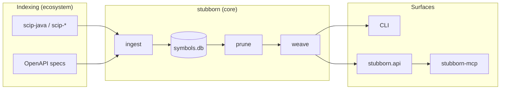

# Stubborn AI

**Deterministic LLM context compiler for code symbols and service contracts.**

Stubborn AI is an open engineering program: **architecture-led, AI-assisted development** where the developer defines pipeline shape and boundary protocols; AI implements most of the code; shipped artifacts are **deterministic Python** — reproducible, test-gated, and verifiable.

> **New here?** Read **[USER-JOURNEY.md](docs/USER-JOURNEY.md)** for goal-oriented paths, then **[START-HERE.md](docs/START-HERE.md)** for the full program map. AI assistants: see **[AGENTS.md](AGENTS.md)**.

## Repositories

| Repository | Role | Status |
|------------|------|--------|
| [**stubborn-hub**](https://github.com/stubborn-ai/stubborn-hub) | Program overview, architecture, roadmap | Active |
| [**stubborn**](https://github.com/stubborn-ai/stubborn) | Headless core: SCIP code graph + OpenAPI contract graph → SQLite → prune → weave ([`stubborn-stub`](https://pypi.org/project/stubborn-stub/)) | **Beta** (`0.9.0b6`) |
| [**stubborn-mcp**](https://github.com/stubborn-ai/stubborn-mcp) | Source-neutral MCP server (`workspace_info`, `list_symbols`, `list_contracts`, `get_context`) ([`stubborn-mcp`](https://pypi.org/project/stubborn-mcp/)) | **Beta** (`0.1.0b3`) |
| [**stubborn-watch**](https://github.com/stubborn-ai/stubborn-watch) | Dev orchestration: file watch → scip-java → `index --merge` ([`stubborn-watch`](https://pypi.org/project/stubborn-watch/)) | **Beta** (`0.1.0b3`) |
| [**stubborn-status**](https://github.com/stubborn-ai/stubborn-status) | Federated `doctor` aggregation for terminal, CI, and IDE bridges ([`stubborn-status`](https://pypi.org/project/stubborn-status/)) | **Beta** (`0.1.0b1`) |
| [**stubborn-demo**](https://github.com/stubborn-ai/stubborn-demo) | Runnable demos and validation projects | Active |
| [**vscode-stubborn**](https://github.com/stubborn-ai/vscode-stubborn) | VS Code bridge for MCP setup and sidecar stub UX | Planned |
| **lab-notes** | Private journals, ADR drafts, ecosystem ideas | Active (local / private remote) |

## Release matrix

| Package | Published version | Depends on |
|---------|-------------------|------------|
| `stubborn-stub` | `0.9.0b6` | Core compiler line |
| `stubborn-mcp` | `0.1.0b3` | `stubborn-stub>=0.9.0b6,<1.0` |
| `stubborn-watch` | `0.1.0b3` | `stubborn-stub>=0.9.0b6,<1.0` |
| `stubborn-status` | `0.1.0b1` | — (subprocess `doctor --json`; no `stubborn-stub` runtime dep) |

Details: [ECOSYSTEM.md](docs/ECOSYSTEM.md) · [ROADMAP.md](docs/ROADMAP.md)

## Pipeline



**Horizontal (optional):** weak coupling to [anchor-migration](https://github.com/anchor-migration) — Duke's Bank LLM context, migration runbooks. See [INTEGRATION.md](docs/INTEGRATION.md).

## Design principles

1. **SCIP is the code-symbol machine index** — Stubborn does not parse source for production code graphs ([stubborn ADR-001](https://github.com/stubborn-ai/stubborn/blob/main/docs/adr/ADR-001-scip-as-machine-index.md)).
2. **OpenAPI is the REST contract truth source** — contract endpoints and schema facts live beside code facts without being forced into SCIP ([ADR-011](https://github.com/stubborn-ai/stubborn/blob/main/docs/adr/ADR-011-openapi-contract-graph.md), [ADR-013](https://github.com/stubborn-ai/stubborn/blob/main/docs/adr/ADR-013-source-neutral-contract-queries.md)).
3. **SQLite graph store as SSoT** — one file per workspace snapshot; prune/weave read code and contract facts from it.
4. **Deterministic core** — same index + target + options → same context text.
5. **Architecture-led, AI-implemented** — ADRs and E2E cases document intent; code is ordinary Python.
6. **Composable repos** — core compiler, MCP adapter, watch orchestration, and demos/validation ship on independent cadences.
7. **Honest scope** — Java-first beta for code weave quality; contract graph support is protocol-first and evidence-tiered.

See [stubborn DEVELOPMENT-MODEL](https://github.com/stubborn-ai/stubborn/blob/main/docs/DEVELOPMENT-MODEL.md) for roles and boundary protocols.

## Local workspace layout

```
stubborn-ai/
├── stubborn-hub/       # this repository
├── stubborn/           # core compiler
├── stubborn-mcp/       # MCP server
├── stubborn-watch/     # dev-loop orchestration
├── stubborn-status/    # federated doctor aggregation
├── stubborn-demo/      # runnable demos & validation
├── vscode-stubborn/    # VS Code bridge
├── lab-notes/          # private — journals & ideas
└── stubborn-ai.code-workspace
```

## Documentation

- **[Start here](docs/START-HERE.md)** — program map, reading order, conventions
- [AGENTS.md](AGENTS.md) — AI session bootstrap
- [Architecture](docs/ARCHITECTURE.md) — layers, repo map, diagrams
- [Ecosystem](docs/ECOSYSTEM.md) — current and planned repositories
- [Roadmap](docs/ROADMAP.md) — near-term program phases (lean)
- [Integration](docs/INTEGRATION.md) — anchor-migration and optional consumers
- [Demo launchers](docs/DEMO-LAUNCHERS.md) — explicit env/CLI contracts for validation scripts
- [PetClinic validation](docs/PETCLINIC-VALIDATION.md) — monolith vs microservices proof model
- [stubborn ADR-015](https://github.com/stubborn-ai/stubborn/blob/main/docs/adr/ADR-015-federated-doctor-diagnostics.md) — federated `doctor` per package
- [stubborn ADR-016](https://github.com/stubborn-ai/stubborn/blob/main/docs/adr/ADR-016-doctor-status-aggregation.md) — `stubborn-status` doctor aggregation
- [stubborn docs](https://github.com/stubborn-ai/stubborn/tree/main/docs) — product specs, ADRs, BETA
- [stubborn-mcp](https://github.com/stubborn-ai/stubborn-mcp) — MCP install, Cursor config

## Getting started

**New here?** Follow the goal-oriented map: **[USER-JOURNEY.md](docs/USER-JOURNEY.md)**.

**Compiler only (CLI):**

```bash
pip install stubborn-stub
stubborn index --fixture minimal --out /tmp/symbols.db
stubborn context /tmp/symbols.db \
  --target "semanticdb maven com/example/OrderService#" \
  --out /tmp/order-service.stub.java
```

**Agents (Cursor / MCP)** — build `metadata/symbols.db` first (fixture above or real SCIP), then:

```bash
pip install stubborn-stub stubborn-mcp
export STUBBORN_DB=metadata/symbols.db
stubborn-mcp doctor
```

For binary SCIP from scip-java, use `pip install "stubborn-stub[scip]"` and
`stubborn index --scip index.scip --out metadata/symbols.db`. Contract/OpenAPI
workflows: see [USER-JOURNEY.md](docs/USER-JOURNEY.md) Journey D and
[stubborn-demo spring-petclinic-microservices](https://github.com/stubborn-ai/stubborn-demo/tree/main/spring-petclinic-microservices).

Full quickstart: [stubborn README](https://github.com/stubborn-ai/stubborn#try-in-30-seconds-no-java-required).
Troubleshooting: [stubborn TROUBLESHOOTING](https://github.com/stubborn-ai/stubborn/blob/main/docs/TROUBLESHOOTING.md).

**Setup diagnostics (federated doctor):**

```bash
stubborn doctor --json
stubborn-status --json            # aggregate installed packages' doctor reports
stubborn-status --require stubborn-mcp,stubborn-watch
```

Specs: [ADR-015](https://github.com/stubborn-ai/stubborn/blob/main/docs/adr/ADR-015-federated-doctor-diagnostics.md), [ADR-016](https://github.com/stubborn-ai/stubborn/blob/main/docs/adr/ADR-016-doctor-status-aggregation.md).

## License

MIT — see LICENSE in each repository.
