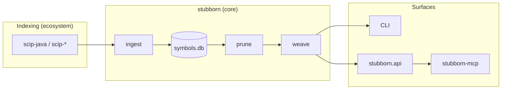

# Stubborn AI

**Deterministic LLM context compiler for SCIP-indexed codebases.**

Stubborn AI is an open engineering program: **architecture-led, AI-assisted development** where the developer defines pipeline shape and boundary protocols; AI implements most of the code; shipped artifacts are **deterministic Python** — reproducible, test-gated, and verifiable.

> **New here?** Read **[START-HERE.md](docs/START-HERE.md)** for the full program map. AI assistants: see **[AGENTS.md](AGENTS.md)**.

## Repositories

| Repository | Role | Status |
|------------|------|--------|
| [**stubborn-hub**](https://github.com/stubborn-ai/stubborn-hub) | Program overview, architecture, roadmap | Active |
| [**stubborn**](https://github.com/stubborn-ai/stubborn) | Core compiler: SCIP → SQLite → prune → weave ([`stubborn-stub`](https://pypi.org/project/stubborn-stub/)) | **Beta** (`0.9.0b4`) |
| [**stubborn-mcp**](https://github.com/stubborn-ai/stubborn-mcp) | MCP server ([`stubborn-mcp`](https://pypi.org/project/stubborn-mcp/)) | **Beta** (`0.1.0b1`) |
| **stubborn-watch** | Dev orchestration: file watch → scip-java → `index --merge` | 💡 Planned — see [ADR-009](https://github.com/stubborn-ai/stubborn/blob/main/docs/adr/ADR-009-incremental-index-merge.md) |
| **lab-notes** | Private journals, ADR drafts, ecosystem ideas | Active (local / private remote) |

Details: [ECOSYSTEM.md](docs/ECOSYSTEM.md) · [ROADMAP.md](docs/ROADMAP.md)

## Pipeline



**Horizontal (optional):** weak coupling to [anchor-migration](https://github.com/anchor-migration) — Duke's Bank LLM context, migration runbooks. See [INTEGRATION.md](docs/INTEGRATION.md).

## Design principles

1. **SCIP is the machine index** — Stubborn does not parse source for production graphs ([stubborn ADR-001](https://github.com/stubborn-ai/stubborn/blob/main/docs/adr/ADR-001-scip-as-machine-index.md)).
2. **SQLite symbol graph as SSoT** — one file per project snapshot; prune/weave read from it.
3. **Deterministic core** — same index + target + options → same stub text.
4. **Architecture-led, AI-implemented** — ADRs and E2E cases document intent; code is ordinary Python.
5. **Composable repos** — core compiler, MCP adapter, watch orchestration ship on independent cadences.
6. **Honest scope** — Java-first beta; multi-language and dev UX layers grow with E2E proof.

See [stubborn DEVELOPMENT-MODEL](https://github.com/stubborn-ai/stubborn/blob/main/docs/DEVELOPMENT-MODEL.md) for roles and boundary protocols.

## Local workspace layout

```
stubborn-ai/
├── stubborn-hub/       # this repository
├── stubborn/           # core compiler
├── stubborn-mcp/       # MCP server
├── lab-notes/          # private — journals & ideas
└── stubborn-ai.code-workspace
```

## Documentation

- **[Start here](docs/START-HERE.md)** — program map, reading order, conventions
- [AGENTS.md](AGENTS.md) — AI session bootstrap
- [Architecture](docs/ARCHITECTURE.md) — layers, repo map, diagrams
- [Ecosystem](docs/ECOSYSTEM.md) — current and planned repositories
- [Roadmap](docs/ROADMAP.md) — near-term program phases (lean)
- [Integration](docs/INTEGRATION.md) — anchor-migration and optional consumers
- [stubborn docs](https://github.com/stubborn-ai/stubborn/tree/main/docs) — product specs, ADRs, BETA
- [stubborn-mcp](https://github.com/stubborn-ai/stubborn-mcp) — MCP install, Cursor config

## Getting started

**Compiler only (CLI):**

```bash
pip install stubborn-stub
stubborn index --scip index.scip --out /tmp/symbols.db
stubborn context /tmp/symbols.db \
  --target "semanticdb maven com/example/OrderService#" \
  --out /tmp/order-service.stub.java
```

**Agents (Cursor / MCP):**

```bash
pip install stubborn-stub stubborn-mcp
stubborn index --scip index.scip --out metadata/symbols.db
export STUBBORN_DB=metadata/symbols.db
stubborn-mcp
```

Full quickstart: [stubborn README](https://github.com/stubborn-ai/stubborn#try-in-30-seconds-no-java-required).

## License

MIT — see LICENSE in each repository.
