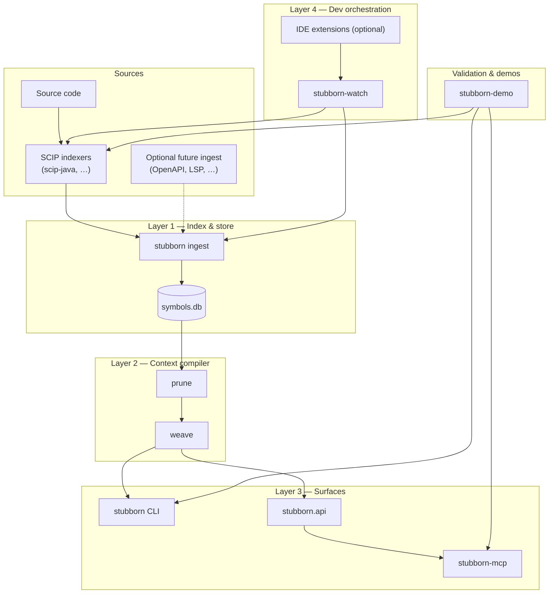
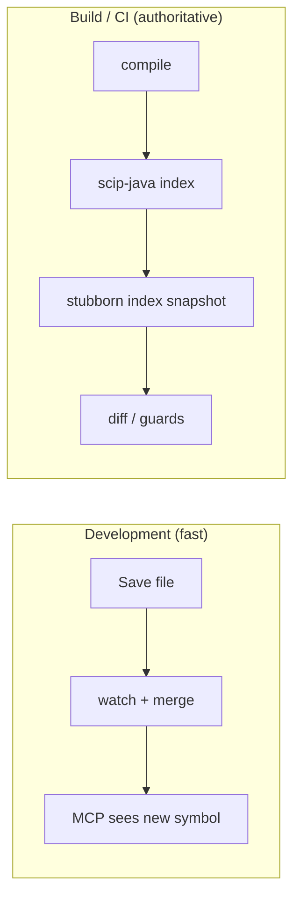
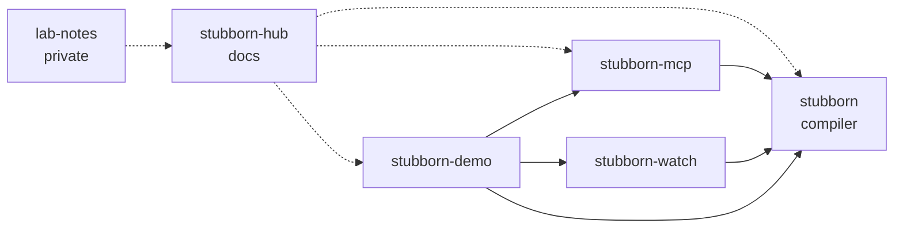

# Architecture

## Overview

Stubborn AI is a **multi-repo program** for compiling SCIP symbol graphs into bounded, privacy-safe LLM context. The `stubborn` repo is the headless core; surrounding repos own surfaces, orchestration, and runnable validation projects. Shared contracts (`IndexSnapshot`, SQLite schema v1+, `stubborn.api`) link layers without a monorepo.

**Visual maps:** [Program overview](#program-overview) · [Developer experience layers](#developer-experience-layers) · [Repository map](#repository-map)

Significant design changes are recorded as ADRs in [`stubborn/docs/adr/`](https://github.com/stubborn-ai/stubborn/tree/main/docs/adr).

## Program overview

Repos are **independent**; integration is via **PyPI packages**, **CLI**, and **SQLite snapshot files** (`symbols.db`).

| Stage | Owner | Input | Output |
|-------|-------|-------|--------|
| SCIP indexing | External indexer | Source tree | `index.scip` |
| Ingest | `stubborn` | SCIP | `symbols.db` |
| Context compile | `stubborn` | `symbols.db` + target | stub text |
| Agent access | `stubborn-mcp` | API calls | MCP tool JSON |
| Dev hot path | `stubborn-watch` | File events | merge into `symbols.db` |
| Demos / validation | `stubborn-demo` | Runnable projects | black-box proof via CLI / MCP |

## Developer experience layers

Complete DX requires all layers; beta today ships the headless core, MCP, watch scaffold, and runnable Java validation projects.

| Mode | Trigger | Stubborn command | Index run semantics |
|------|---------|------------------|---------------------|
| **Hot** | Save / watch | `index --merge` | Update active run by `relative_path` ([ADR-009](https://github.com/stubborn-ai/stubborn/blob/main/docs/adr/ADR-009-incremental-index-merge.md)) |
| **Cold** | Compile / CI | `index` (default) | Append full snapshot `index_run` |

SCIP remains **canonical** for CI and reconcile. Optional non-SCIP ingest adapters (lab idea) are **opt-in** and must carry provenance — see `lab-notes/ideas/pluggable-ingest.md`.

## Repository map

| Repository | Layer | Depends on |
|------------|-------|------------|
| `stubborn-hub` | Program docs | — |
| `stubborn` | Headless core: L1 + L2 + CLI + API | SCIP ecosystem |
| `stubborn-mcp` | L3 (MCP) | `stubborn-stub` |
| `stubborn-watch` | L4 (orchestration) | `stubborn-stub`, scip-java |
| `stubborn-demo` | Runnable demos / validation | `stubborn-stub`, `stubborn-mcp`, `stubborn-watch`, scip-java |
| `lab-notes` | Private drafts | — |

Future ideas (not committed repos): `stubborn-indexer` (multi-SCIP CLI glue), `vscode-stubborn`, `stubborn-ingest-openapi` — tracked in lab-notes only.

## Contracts (boundary protocols)

| Boundary | Contract | Document |
|----------|----------|----------|
| SCIP → snapshot | `IndexSnapshot`, ingest enrichment | [SCIP-INGEST](https://github.com/stubborn-ai/stubborn/blob/main/docs/SCIP-INGEST.md) |
| Snapshot → store | SQLite schema v1+ | [ADR-002](https://github.com/stubborn-ai/stubborn/blob/main/docs/adr/ADR-002-sqlite-symbol-graph-ssot.md) |
| Store → context | `stubborn.api`, budgets, weave options | `stubborn` source |
| Output formats | `java-stub`, `stubborn-dsl` grammars | [STUBBORN-DSL](https://github.com/stubborn-ai/stubborn/blob/main/docs/STUBBORN-DSL.md) |
| Agent tools | MCP tool schemas | [MCP.md](https://github.com/stubborn-ai/stubborn/blob/main/docs/MCP.md) → moves to `stubborn-mcp` |

## Relationship to anchor-migration

Stubborn AI is an **independent org**. [anchor-migration](https://github.com/anchor-migration) may consume `stubborn` as optional horizontal LLM context — not as an SSOT pipeline layer. See [INTEGRATION.md](INTEGRATION.md).

## References

- [ECOSYSTEM.md](ECOSYSTEM.md)
- [ROADMAP.md](ROADMAP.md)
- [stubborn ADR index](https://github.com/stubborn-ai/stubborn/blob/main/docs/adr/README.md)
