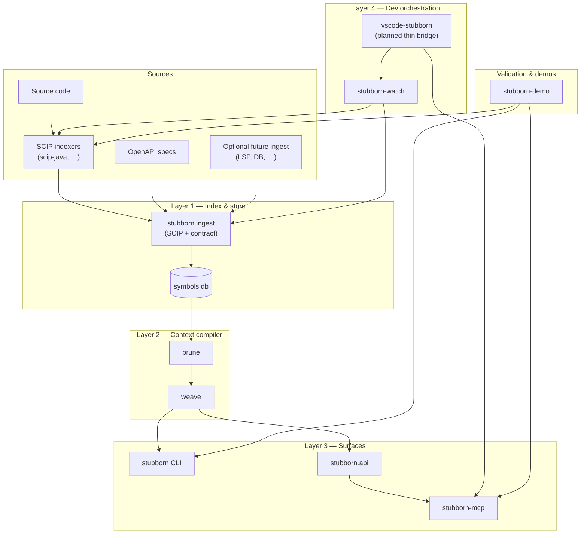
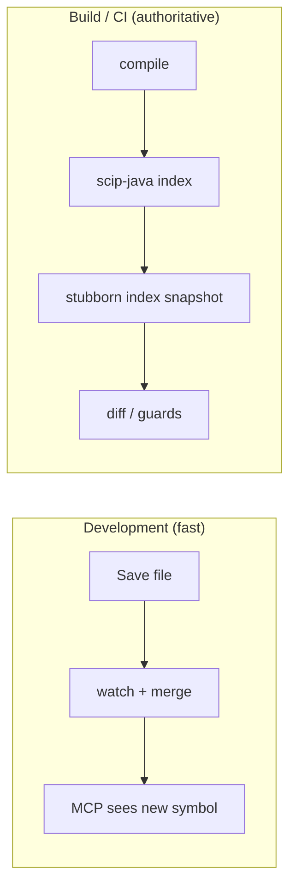
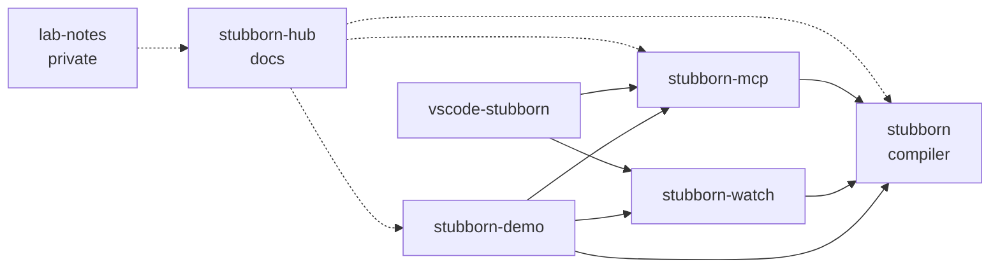

# Architecture

## Overview

Stubborn AI is a **multi-repo program** for compiling deterministic graph facts into bounded, privacy-safe LLM context. SCIP remains the canonical code-symbol input; OpenAPI is the canonical REST contract input. The `stubborn` repo is the headless core; surrounding repos own surfaces, orchestration, and runnable validation projects. Shared contracts (`IndexSnapshot`, schema v4 contract tables, `stubborn.api`) link layers without a monorepo.

**Visual maps:** [Program overview](#program-overview) · [Developer experience layers](#developer-experience-layers) · [Repository map](#repository-map)

Significant design changes are recorded as ADRs in [`stubborn/docs/adr/`](https://github.com/stubborn-ai/stubborn/tree/main/docs/adr).

## Program overview

Repos are **independent**; integration is via **PyPI packages**, **CLI**, and **SQLite snapshot files** (`symbols.db`).

| Stage | Owner | Input | Output |
|-------|-------|-------|--------|
| SCIP indexing | External indexer | Source tree | `index.scip` |
| Code ingest | `stubborn` | SCIP / JSON fixture | code-symbol graph facts |
| Contract ingest | `stubborn` | OpenAPI spec or explicit manifest | endpoint/schema/binding facts |
| Store | `stubborn` | code + contract facts | `symbols.db` |
| Context compile | `stubborn` | `symbols.db` + code or endpoint target | `java-stub` / `stubborn-dsl` context |
| Agent access | `stubborn-mcp` | API calls | source-neutral MCP tool JSON |
| Dev hot path | `stubborn-watch` | File events | merge into `symbols.db` |
| IDE bridge | `vscode-stubborn` | VS Code commands/settings | MCP setup + sidecar stubs |
| Demos / validation | `stubborn-demo` | Runnable projects | black-box proof via CLI / MCP |

## Developer experience layers

Complete DX requires all layers; beta today ships the headless core, MCP, watch package, and runnable Java validation projects.

| Mode | Trigger | Stubborn command | Index run semantics |
|------|---------|------------------|---------------------|
| **Hot** | Save / watch | `index --merge` | Update active run by `relative_path` ([ADR-009](https://github.com/stubborn-ai/stubborn/blob/main/docs/adr/ADR-009-incremental-index-merge.md)) |
| **Cold** | Compile / CI | `index` (default) | Append full snapshot `index_run` |

SCIP remains **canonical** for code-symbol CI and reconcile. OpenAPI contract graph support is implemented in `stubborn index-openapi`; explicit bindings use `stubborn index-contract`. Contract facts are physically separate from SCIP facts and are composed at query time ([ADR-012](https://github.com/stubborn-ai/stubborn/blob/main/docs/adr/ADR-012-schema-v4-contract-evidence.md), [ADR-013](https://github.com/stubborn-ai/stubborn/blob/main/docs/adr/ADR-013-source-neutral-contract-queries.md)).

## Repository map

| Repository | Layer | Depends on |
|------------|-------|------------|
| `stubborn-hub` | Program docs | — |
| `stubborn` | Headless core: L1 + L2 + CLI + API | SCIP ecosystem, OpenAPI specs |
| `stubborn-mcp` | L3 (MCP) | `stubborn-stub` |
| `stubborn-watch` | L4 (orchestration) | `stubborn-stub`, scip-java |
| `vscode-stubborn` | L4 (VS Code bridge) | `stubborn-mcp`, `stubborn-watch`, `stubborn-status` (planned) |
| `stubborn-status` | L4 (setup aggregation) | federated `doctor` CLIs via subprocess ([ADR-016](https://github.com/stubborn-ai/stubborn/blob/main/docs/adr/ADR-016-doctor-status-aggregation.md)) |
| `stubborn-demo` | Runnable demos / validation | `stubborn-stub`, `stubborn-mcp`, `stubborn-watch`, scip-java |
| `lab-notes` | Private drafts | — |

Future ideas (not committed repos): `stubborn-indexer` (multi-SCIP CLI glue), `intellij-stubborn`, LSP/DB ingest adapters beyond OpenAPI — tracked in lab-notes only. **`stubborn-status`** ships in [ADR-016](https://github.com/stubborn-ai/stubborn/blob/main/docs/adr/ADR-016-doctor-status-aggregation.md).

## Contracts (boundary protocols)

| Boundary | Contract | Document |
|----------|----------|----------|
| SCIP → snapshot | `IndexSnapshot`, ingest enrichment | [SCIP-INGEST](https://github.com/stubborn-ai/stubborn/blob/main/docs/SCIP-INGEST.md) |
| OpenAPI/manifest → contract graph | Endpoint stable IDs, schema constraints, binding evidence tiers | [ADR-011](https://github.com/stubborn-ai/stubborn/blob/main/docs/adr/ADR-011-openapi-contract-graph.md), [ADR-012](https://github.com/stubborn-ai/stubborn/blob/main/docs/adr/ADR-012-schema-v4-contract-evidence.md) |
| Snapshot/contract → store | SQLite schema v4 | [ADR-002](https://github.com/stubborn-ai/stubborn/blob/main/docs/adr/ADR-002-sqlite-symbol-graph-ssot.md), [ADR-012](https://github.com/stubborn-ai/stubborn/blob/main/docs/adr/ADR-012-schema-v4-contract-evidence.md) |
| Store → context | Source-neutral `stubborn.api`, budgets, weave options | [ADR-013](https://github.com/stubborn-ai/stubborn/blob/main/docs/adr/ADR-013-source-neutral-contract-queries.md) |
| Output formats | `java-stub`, `stubborn-dsl` grammars | [STUBBORN-DSL](https://github.com/stubborn-ai/stubborn/blob/main/docs/STUBBORN-DSL.md) |
| Agent tools | MCP tool schemas (`workspace_info`, `list_symbols`, `list_contracts`, `get_context`, `metrics`) | [stubborn-mcp MCP.md](https://github.com/stubborn-ai/stubborn-mcp/blob/main/docs/MCP.md) |
| Setup diagnostics | Doctor Report v1, Status Report v1 | [ADR-015](https://github.com/stubborn-ai/stubborn/blob/main/docs/adr/ADR-015-federated-doctor-diagnostics.md), [ADR-016](https://github.com/stubborn-ai/stubborn/blob/main/docs/adr/ADR-016-doctor-status-aggregation.md) |

## Relationship to anchor-migration

Stubborn AI is an **independent org**. [anchor-migration](https://github.com/anchor-migration) may consume `stubborn` as optional horizontal LLM context — not as an SSOT pipeline layer. See [INTEGRATION.md](INTEGRATION.md).

## References

- [ECOSYSTEM.md](ECOSYSTEM.md)
- [ROADMAP.md](ROADMAP.md)
- [stubborn ADR index](https://github.com/stubborn-ai/stubborn/blob/main/docs/adr/README.md)
